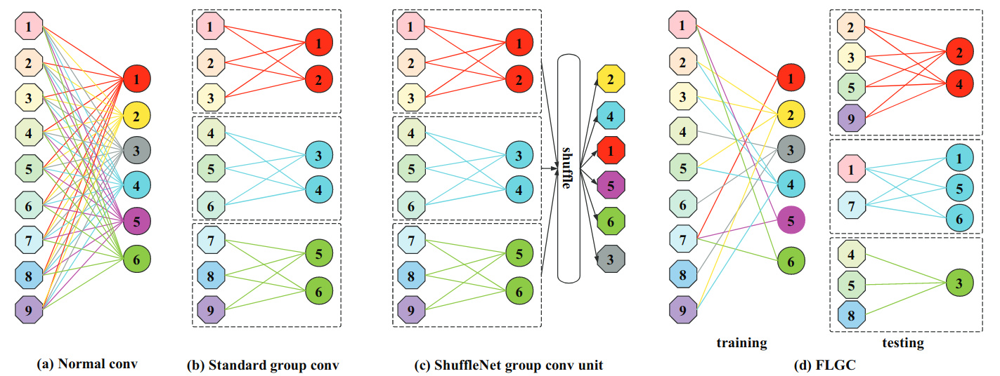

# Code for the paper "Fully Learnable Group Convolution for Acceleration of Deep Neural Networks", CVPR 2019

## Description
Implementation of the paper ["Fully Learnable Group Convolution for Acceleration of Deep Neural Networks"](https://arxiv.org/pdf/1904.00346.pdf):

Given a group number, it proposes to learn which input channels form each group and which filters work with each group. This is obtained with the proposed fully learnable group convolution (FLGC) layer.

## Results on CIFAR-10

| Method                   | Number of groups | MFLOPS | Accuracy, % | Model       |
|:-------------------------|:-----------------|:-------|:------------|:------------|
| MobileNet V2             | N/A              | 94.9   |94.43        | N/A         |
| MobileNet V2-FLGC (paper)| 8                | 76     |93.09        | N/A         |
| MobileNet V2-FLGC (ours) | 8                | 62.6   |93.7         | [Google Drive](https://drive.google.com/file/d/1RXFS9VQmcXvW7698UI4lWmDWRlTEAqjt/view?usp=sharing)|

## Implementation Notes

As an important note (and major drawback for practical usage), there is no such built-in layer, which supports grouping with custom (not uniform) input channels/filters split. So, to see faster network inference time, one should implement it.

The follow-up paper ["Differentiable Learning-to-Group Channels via Groupable Convolutional Neural Networks"](https://arxiv.org/pdf/1908.05867.pdf) extends this work by making group number also learnable. Despite the improvement in theoretical model complexity, the lack of such inference-optimized layer makes it hard to apply for practical usage.

### Training on CIFAR-10 with standard and fully learnable group convolutions

We have obtained similar results with standard and fully learnable group convolutions in terms of accuracy for MobileNet V2. Accuracy can float up to 0.5% from run to run, which hides the benefit of using fully learnable grouping in these experiments. Possibly experiments at a large scale (ImageNet) will show the full potential of this approach.

### Model Architecture

Since there is no official MobileNet V2 for CIFAR-10 (and authors provide no pre-trained model), there are may be differences between network architectures. We use one from [pytorch-cifar](https://github.com/kuangliu/pytorch-cifar).

### FLOPS measurement

FLOPS were measured with [ptflops](https://github.com/sovrasov/flops-counter.pytorch).

